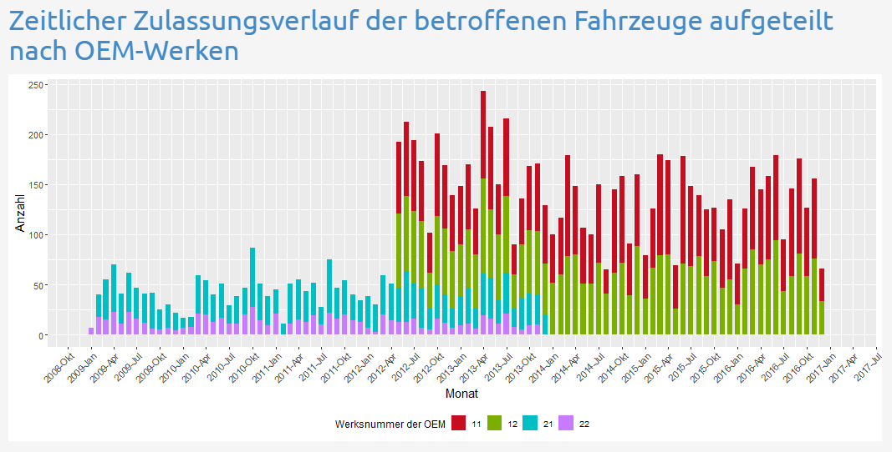

<style>


  /* Text */
  
  font-family: "Latin Modern"
  

  /* Header */

  #header {
    margin-top: 64px;
    margin-bottom: 128px;
    border-radius: 10px;
    border: solid;
    text-align: center;
  }
  
  
  /* Tabellen */
  
  table thead {
    border-bottom-style: solid;
    border-bottom-width: 1px;
  }
  table th {
    padding-left: 8px;
    padding-right: 8px;
  }
  table td {
    padding-left: 8px;
    padding-right: 8px;
  }
  
</style>

```{r setup, include=FALSE}
knitr::opts_chunk$set(echo = TRUE)

if(!require(rmdformats)){
  install.packages("rmdformats")
}
library("rmdformats")

```


# Einleitung

Das Ziel dieser Case Study ist die Verdeutlichung und Aufklärung von und über Produktionsproblemen eines Unternehmens "111", das Ledersitze für Automobilhersteller aus eingekauften Einzelteilen zusammenbaut. Nach Hinweis durch den Automobilhersteller auf Kundenreklamationen sollen von allen beteiligten Schritten der Kette vom Einzelteilhersteller bis zum Kunden Daten zu defekten Fahrzeugen zusammengetragen, aufbereitet und ausgewertet werden.

Zusätzlich soll ein Tool generiert werden mit dessen Hilfe Automobilbesitzer anhand ihrer Zulassungsnummer überprüfen können ob ihr Fahrzeug von den Defekten betroffen ist.


## Benötigte Libraries

```{r libraries, message = FALSE, warning = FALSE}
if(!require(knitr)){
  install.packages("knitr")
}
library(knitr)

if(!require(kableExtra)){
  install.packages("kableExtra")
}
library(kableExtra)

if(!require(magrittr)){
  install.packages("magrittr")
}
library(magrittr)

if(!require(tidyverse)){
  install.packages("tidyverse")
}
library(tidyverse)

if(!require(readr)){
  install.packages("readr")
}
library(readr)
```


# Importieren der Daten

## Auswahl der relevanten Daten

Die Aufgabe bestand grundsätzlich darin, aus Sicht des Herstellers "111" für die Komponente Premium-Ledersitze alle Fahrzeuge mit fehlerhaften Komponenten des entsprechenden Typs bzw. fehlerhaften Einzelteilen, die in jenen Komponenten enthalten sind, zu identifizieren und Fahrzeughalter und -hersteller (OEM) zu isolieren und informieren.

Dazu galt es zunächst, alle für die Analyse und Fehleridentifizierung relevanten Datensätze zu importieren. Diese entsprechen der Komponente "K2LE1" mit den Einzelteilen "T11", "T14" und "T15" sowie "K2LE2" mit den Einzelteilen "T16", "T19" und "T20", den Fahrzeugen "Typ11" und "Typ12" des Herstellers "OEM1" sowie "Typ21" und "Typ22" des Herstellers "OEM2" und die entsprechenden Geodaten für Werke der "Tier2" (Einzelteile), "Tier1" (Komponenten) und "OEM". Für die Zuordnung zu Fahrzeughaltern und die spätere visuelle Darstellung der räumlichen Verteilung der Defekte waren die Datensätze "Zulassungen" mit den entsprechenden Geodaten "Gemeinden" relevant.

Um die Datensätze zu einem zusammenfassen, standen die relationalen Tabellen "Bestandteile_Komponente" (für Einzelteile und Komponenten) und "Bestandteile_Fahrzeug" (für Komponenten und Fahrzeuge) zur Verfügung.

```{r overview import, echo = FALSE, results = 'asis', cache=TRUE}
# print overview of imported data as table in .Rmd document
a <- c("Einzelteil_T11.txt", "Einzelteil_T14.csv", "Einzelteil_T15.csv", "Einzelteil_T16.txt", "Einzelteil_T19.csv", "Einzelteil_T20.txt")

b <- c("Komponente_K2LE1.txt", "Komponente_K2LE2.txt", "Fahrzeuge_OEM1_Typ11.csv", "Fahrzeuge_OEM1_Typ12.csv", "Fahrzeuge_OEM1_Typ21.csv", "Fahrzeuge_OEM1_Typ22.csv")

c <- c("Bestandteile_Komponente_K2LE1.csv","Bestandteile_Komponente_K2LE2.csv", "Bestandteile_Komponente_OEM1_Typ11.csv","Bestandteile_Komponente_OEM1_Typ12.csv","Bestandteile_Komponente_OEM2_Typ21.csv","Bestandteile_Komponente_OEM2_Typ22.csv")

d <- c("Zulassungen_alle_Fahrzeuge.csv", "Tier1_Werke_2017-07-11_v1.2_TrR.csv", "Tier2_Werke_2017-07-11_v1.2_TrR.csv", "OEM_Werke_2017-07-04_TrR.csv", "Geodaten_Gemeinden_v1.2_2017-08-22_TrR.csv", "")

import <- cbind(a,b,c,d)
colnames(import) <- c("Einzelteile", "Komponenten und Fahrzeuge", "Relationale Tabellen", "Zulassungen und Geodaten")
kable(import, caption = "Importierte Daten")

```

## Vorgehensweise zur Importierung der Datensätze

Die zur Verfügung gestellten Dateien wurden mit dem readr-Package importiert. Die Daten lagen in unterschiedlichen Datei-Formaten (.txt und .csv) und unterschiedlichen Strukturen (verschiedene Delimiter und Spaltenanzahlen) vor.

Die Schwierigkeit beim Import der Einzelteile "T11", "T16" und "T20" sowie der Komponenten "K2LE1" und "K2LE2" lag zunächst im .txt-Format und in unregelmäßigen Delimitern zwischen den Spalten und Zeilen. Deshalb mussten die genannten Daten zunächst mit der Funktion read_file() als string eingelesen und in einem Objekt zwischengespeichert werden, um Performance-Probleme und Parsing-Fehler zu vermeiden. Danach wurden die Delimiter zwischen den Spalten mit für .csv-Dateien üblichen Delimitern ersetzt und dann der Delimiter zwischen den Zeilen mit einem Line-Break ertsetzt. Außerdem hat in den betroffenen Datensätzen jeweils die erste Variable gefehlt, während die Spalte jedoch mit Werten befüllt war, was beim Einlesen zu Parsing-Fehlern führen würde. Deshalb wurde mit paste() eine entsprechende Variable mit Namen "X1_1" oder "X2" an den Beginn des Datensatzes als Platzhalter eingefügt. Hinterher konnten die fertig vorbereiteten Datensätze mit read_delim() bzw. read_csv2() importiert werden. Die Platzhalterobjekte wurden im Anschluss gelöscht, um Speicherressourcen freizugeben.

```{r import data, results = 'hide', message= FALSE, warning = FALSE, cache=TRUE}
# read relevant Einzelteil files with exotic delimiters in txt-files (T11, T16, T20) as string (for better performance)
einzelteil_t11_string <- read_file("Data/Einzelteil/Einzelteil_T11.txt")
einzelteil_t16_string <- read_file("Data/Einzelteil/Einzelteil_T16.txt")
einzelteil_t20_string <- read_file("Data/Einzelteil/Einzelteil_T20.txt")

# replace exotic delimiters between columns
einzelteil_t11_string <- gsub("\t", ",", einzelteil_t11_string)
einzelteil_t16_string <- gsub(" \\| \\| ", ",", einzelteil_t16_string)
einzelteil_t20_string <- gsub(" \\| \\| ", ",", einzelteil_t20_string)

# paste missing column name at first position to avoid parsing error when read_csv will be used
einzelteil_t11_string <- paste("X1_1", einzelteil_t11_string, sep = ",")
einzelteil_t16_string <- paste("X1_1", einzelteil_t16_string, sep = ",")
einzelteil_t20_string <- paste("X1_1", einzelteil_t20_string, sep = ",")

# replace exotic delimiters between rows with line breaks
einzelteil_t11_string <- gsub("", "\n", einzelteil_t11_string)
einzelteil_t16_string <- gsub("\t", "\n", einzelteil_t16_string)
einzelteil_t20_string <- gsub(" ", "\n", einzelteil_t20_string)

# Import final csv-files
# read_csv (delim = ","), coerce col_type for t16 because data is split on several columns which causes parsing errors
t11 <- read_delim(einzelteil_t11_string, delim = ",")
t16 <- read_delim(einzelteil_t16_string, delim = ",", col_types = c("nncDnnnDncDnnnDncDnnnDn"))
t20 <- read_delim(einzelteil_t20_string, delim = ",")

# remove unused objects and return memory
einzelteil_t11_string <- ""
einzelteil_t16_string <- ""
einzelteil_t20_string <- ""
gc()

# read file for Komponenete_K2LE1 and replace delim with single character delim
tx  <- read_file("Data/Komponente/Komponente_K2LE1.txt")
tx2 <- gsub(pattern = "II", replace = ";", x = tx, fixed = TRUE)
# add column name 
tx3 <- paste("X2", tx2, sep = ";")
# replace exotic separator with newline
out <- gsub(pattern = "", replace = "\n", x = tx3, fixed = TRUE)
# write output in temp file 
myFile <- tempfile()
writeLines(out, con=myFile)

# read final komponente_k2le1
komponente_k2le1 <- read_csv2(myFile, col_types = c("nncDnnnDncDnnnDn"))

# read file for Komponenete_K2LE2 because first column name is missing
temp1 <- read_file("Data/Komponente/Komponente_K2LE2.txt")
# add first column name
temp2 <- paste("X2", temp1, sep = "\\")
# write into temporary file
myFile2 <- tempfile()
writeLines(temp2, con=myFile2)

# read final komponente_k2le1
komponente_k2le2 <- read_delim(myFile2, delim = "\\") 

# remove unused objects and free memory
temp1 <- ""
temp2 <- ""
myFile2 <- ""
gc()

```

Alle anderen Datensätze konnten ohne weitere Eingriffe entsprechend ihres Delimiters mit read_csv() (Delimiter ";") oder read_csv2() (Delimiter ",") importiert werden. Bei den Datensätzen "T15", T16", "K2LE1" und den Geodaten mussten die Klassen für die einzelnen Variablen bzw. Spalten per col_types() vorgegeben werden, da es sonst aufgrund einer hohen Zahl fehlender Werte in diesen Datensätzen zu Parsing-Fehlern kam.

```{r import data 2, results = 'hide', message= FALSE, warning = FALSE, cache=TRUE}
# read_csv2 (delim = ";") and read_csv (delim = ",") for remaining relevant Einzelteil datasets, coerce col_type for t15 because data is split on several columns which causes parsing errors
t19 <- read_csv("Data/Einzelteil/Einzelteil_T19.csv")
t14 <- read_csv2("Data/Einzelteil/Einzelteil_T14.csv")
t15 <- read_csv2("Data/Einzelteil/Einzelteil_T15.csv", col_types = c("nncDnnnDncDnnnDn"))

# read Bestandteile_Komponenten for relevant Kompenenten (K2LE1, K2LE2)
bestandteile_k2le1 <- read_csv2("Data/Komponente/Bestandteile_Komponente_K2LE1.csv")
bestandteile_k2le2 <- read_csv2("Data/Komponente/Bestandteile_Komponente_K2LE2.csv")

# read Fahrzeuge, use right function for different delims (, and ;) 
fahrzeug_oem1_typ11 <- read_csv("Data/Fahrzeug/Fahrzeuge_OEM1_Typ11.csv")
fahrzeug_oem1_typ12 <- read_csv2("Data/Fahrzeug/Fahrzeuge_OEM1_Typ12.csv")
fahrzeug_oem2_typ21 <- read_csv("Data/Fahrzeug/Fahrzeuge_OEM2_Typ21.csv")
fahrzeug_oem2_typ22 <- read_csv2("Data/Fahrzeug/Fahrzeuge_OEM2_Typ22.csv")

# read Bestandteile_Fahrzeuge
bestandteile_oem1_typ11 <- read_csv2("Data/Fahrzeug/Bestandteile_Fahrzeuge_OEM1_Typ11.csv")
bestandteile_oem1_typ12 <- read_csv2("Data/Fahrzeug/Bestandteile_Fahrzeuge_OEM1_Typ12.csv")
bestandteile_oem2_typ21 <- read_csv2("Data/Fahrzeug/Bestandteile_Fahrzeuge_OEM2_Typ21.csv")
bestandteile_oem2_typ22 <- read_csv2("Data/Fahrzeug/Bestandteile_Fahrzeuge_OEM2_Typ22.csv")

# read zulassungen
zulassungen <- read_csv2("Data/Zulassungen/Zulassungen_alle_Fahrzeuge.csv")

locale = locale(encoding = 'ISO-8859-1')

# Import with readr
tier1 <- read_csv2("Data/Geodaten/Tier1_Werke_2017-07-11_v1.2_TrR.csv",
                   locale = locale, col_types = "ccnnn")
tier2 <- read_csv2("Data/Geodaten/Tier2_Werke_2017-07-11_v1.2_TrR.csv",
                   locale = locale, col_types = "ccnnn")
oem <- read_csv2("Data/Geodaten/OEM_Werke_2017-07-04_TrR.csv",
                   locale = locale, col_types = "ccnnn")
gemeinden <- read_csv2("Data/Geodaten/Geodaten_Gemeinden_v1.2_2017-08-22_TrR.csv", 
                   locale = locale, col_types = "__ccnn")

```

# Datenaufbereitung

Nach dem Importieren galt es die Daten aufzubereiten und in ein analysierbares Format zu bringen. Dazu wurde das "Tidy Data"-Prinzip mit Funktionen aus dem tidyverse-Package angewandt. Ein Datensatz gilt demnach als "tidy", wenn folgende Bedigungen erfüllt sind:

- jede Spalte ist eine Variable
- jede Zeile ist eine Beobachtung
- jede Zelle ist ein Wert

Außerdem mussten die Datensätze von unnützlichen Einträgen wie Zeilen oder Spalten, die keine Daten enthielten, bereinigt werden.

Um einen Eindruck zur Datenstruktur zu erhalten, wurden die Funktionen str() (für die allgemeine Struktur und die Klassen der Variablen) sowie head() und tail() (für Einträge am Anfang und Ende des Datensatzes) angewandt.

## Einzeilteile

Alle Einzelteil-Datensätze hatten jeweils zwei überflüssige Spalten mit den Variablen X1 und X1_1, deren Werte lediglich eine fortlaufende Nummerierung der Spalten darstellten. Diese Spalten wurden entsprechend entfernt. Die Spaltennamen für die IDs wurden als "Einzelteil_ID" für den späteren Join vereinheitlicht. 

Die Einzelteil-Datensätze lagen außerdem in zwei unterschiedlichen Strukturen vor. In den Tabellen "T11", T14", "T19" und "T20" waren die Werte für das jeweilige Produktionsdatum über zwei Spalten verteilt: In der Spalte "Produktionsdatum_01011970_origin" als Anzahl von Tagen im integer-Format basierend auf dem Wert "01-01-1970" in der "origin"-Spalte im Date-Format. Die integer-Werte mussten deshalb entsprechend mit der mutate() Funktion auf das origin-Datum addiert, in einer neuen Variable "Produktionsdatum" gespeichert und die übrigen Spalten gelöscht werden. 

```{r tidy data einzteile, results = 'hide', message = FALSE, warning = FALSE, cache = TRUE}
## Produktionsdatum_Origin_01011970 (in T11, T14, T19, T20) is an integer representing days since origin date
# Transform origin column into Class Date, use mutate to add Produktionsdatum_Origin_01011970 values to origin values
t11 <- t11 %>% 
  mutate(Produktionsdatum = as.Date(origin, format = "%d-%m-%Y") + Produktionsdatum_Origin_01011970) %>% 
  # Remove unnecessary columns and rename ID column to get common column names for all t* datasets
  select(-X1, -X1_1, -origin, -Produktionsdatum_Origin_01011970, ID_Einzelteil = ID_T11) %>%
  # add column "Einzelteil" with unique value
  mutate(Einzelteil="11")
t14 <- t14 %>% 
  mutate(Produktionsdatum = as.Date(origin, format = "%d-%m-%Y") + Produktionsdatum_Origin_01011970) %>%
  select(-X1, -X1_1, -origin, -Produktionsdatum_Origin_01011970, ID_Einzelteil = ID_T14) %>%
  mutate(Einzelteil="14")
t19 <- t19 %>% 
  mutate(Produktionsdatum = as.Date(origin, format = "%d-%m-%Y") + Produktionsdatum_Origin_01011970) %>%
  select(-X1, -X1_1, -origin, -Produktionsdatum_Origin_01011970, ID_Einzelteil = ID_T19) %>%
  mutate(Einzelteil="19")
t20 <- t20 %>% 
  mutate(Produktionsdatum = as.Date(origin, format = "%d-%m-%Y") + Produktionsdatum_Origin_01011970) %>%
  select(-X1, -X1_1, -origin, -Produktionsdatum_Origin_01011970, ID_Einzelteil = ID_T20) %>%
  mutate(Einzelteil="20")

```

In den Datensätzen "T15" und "T16" waren die wesentlichen Variablen jeweils auf zwei (T15) bzw. drei (T16) Spalten (z.B. ID_T16.x, ID_T16.y und ID_T16) verteilt, was eventuell auf einen nicht ordnungsgemäßen Join zurückzuführen ist. Folglich beinhaltete die Tabelle viele fehlende Werte. Nach diesen wurde der Datensatz respektiv gefiltert per Selektierung der Spaltenzahlen in zwei bzw. drei Parts aufgespaltet. Hinterher wurden die Spaltennamen vereinheitlicht und die zwei bzw. drei Parts mittel bind_rows() in jeweils einen Datensatz zusammengeführt.

Außerdem haben alle Einzelteil-Datensätze jeweils eine zusätzliche Spalte "Einzelteil" mit dem Anfangswert ihrer ID-Nummer bekommen, um die Richtigkeit des ID-Werts später prüfen zu können (s. Join-Abschnitt).

```{r tidy data einzteile 2, results = 'hide', message= FALSE, warning = FALSE, cache=TRUE}
# remove unnecessary columns in t15 and t16
t15 <- select(t15, -X1, -X1_1)
t16 <- select(t16, -X1, -X1_1)

# variables in t15 / t16 tables are distributed over two / three parts, split table into two / three tables
t15_part1 <- filter(t15, !is.na(ID_T15.x)) %>% 
  select(c(-8:-14))
t15_part2 <- filter(t15, !is.na(ID_T15.y)) %>%
  select(c(-1:-7))

t16_part1 <- filter(t16, !is.na(ID_T16.x)) %>% 
  select(c(-8:-21))
t16_part2 <- filter(t16, !is.na(ID_T16.y)) %>% 
  select(c(-1:-7, -15:-21)) 
t16_part3 <- filter(t16, !is.na(ID_T16)) %>% 
  select(c(-1:-14)) 

# Rename column names to the same names for all parts of T15 and T16 data set respectively
colnames(t15_part2) <- c("ID_Einzelteil", "Produktionsdatum", "Herstellernummer","Werksnummer", "Fehlerhaft", "Fehlerhaft_Datum", "Fehlerhaft_Fahrleistung" )
colnames(t15_part1) <- colnames(t15_part2)

colnames(t16_part3) <- c("ID_Einzelteil", "Produktionsdatum", "Herstellernummer","Werksnummer", "Fehlerhaft", "Fehlerhaft_Datum", "Fehlerhaft_Fahrleistung" )
colnames(t16_part2) <- colnames(t16_part3)
colnames(t16_part1) <- colnames(t16_part3)

# Bind the two (or three) datasets each into one dataset, respectively
t15 <- bind_rows(t15_part1, t15_part2) %>% 
  # Move column Produktionsdatum to the last position in order to get the same structure for all Einzelteil datasets
  select(-Produktionsdatum, Produktionsdatum) %>%
  mutate(Einzelteil="15")

t16 <- bind_rows(t16_part1, t16_part2, t16_part3) %>%
  select(-Produktionsdatum, Produktionsdatum) %>%
  mutate(Einzelteil="16")

t15_part1 <- ""
t15_part2 <- ""
t16_part1 <- ""
t16_part2 <- ""
t16_part3 <- ""
gc()

```

## Relationstabelle: Bestandteile_Komponenten

Die beiden relevanten Komponenten "K2LE1" und "K2LE2" stehen jeweils in Relation zu drei unterschiedlichen Einzelteilen, deren IDs in den "Bestandteile_Komponente"-Datensätzen jeweils als eine Spalte aufgeführt sind. Um alle Einzelteile in einer Spalte und damit eine Variable "ID_Einzelteil" unterzubringen und den späteren Join zu erleichtern, wurden die Datensätze jeweils nach den drei Einzelteilen aufgeteilt und deren Zeilen mittels bind_rows() zu einem Datensatz verbunden. Analog zu den Einzelteil-Datensätzen wurden unnütze Spalten entfernt und die ID in "ID_Komponente" unbenannt.

```{r tidy data bestandteile_komponenten, results = 'hide', message= FALSE, warning = FALSE, cache=TRUE}
# tidy and transform: Rename "ID_K2LE*" columns to ID_Komponente in order to match with komponenten dataset and remove unnecessary columns
bestandteile_k2le1 <- bestandteile_k2le1 %>%
  select(-X1, ID_Komponente = ID_K2LE1)
bestandteile_k2le2 <- bestandteile_k2le2 %>%
  select(-X1, ID_Komponente = ID_K2LE2)

# Each "Komponente" (k2le1 & k2le2) consists of three parts (t11, t14, t15 & t16, t19, t20): Split into three different tables resepectively and rename "ID_T*" columns into "ID_Einzelteil"
b_k2le1_part1 <- bestandteile_k2le1[, -2:-3] %>%
  rename(ID_Einzelteil = ID_T11)
b_k2le1_part2 <- bestandteile_k2le1[, c(-1,-3)] %>%
  rename(ID_Einzelteil = ID_T14)
b_k2le1_part3 <- bestandteile_k2le1[, -1:-2] %>%
  rename(ID_Einzelteil = ID_T15)

b_k2le2_part1 <- bestandteile_k2le2[, -2:-3]%>%
  rename(ID_Einzelteil = ID_T16)
b_k2le2_part2 <- bestandteile_k2le2[, c(-1,-3)] %>%
  rename(ID_Einzelteil = ID_T19)
b_k2le2_part3 <- bestandteile_k2le2[, -1:-2] %>%
  rename(ID_Einzelteil = ID_T20)

# bind the split tables into one table respectively
bestandteile_k2le1_clean <- bind_rows(b_k2le1_part1, b_k2le1_part2, b_k2le1_part3)
bestandteile_k2le2_clean <- bind_rows(b_k2le2_part1, b_k2le2_part2, b_k2le2_part3)

# remove unused objects
b_k2le1_part1 <- ""
b_k2le1_part2 <- ""
b_k2le1_part3 <- ""
b_k2le2_part1 <- ""
b_k2le2_part2 <- ""
b_k2le2_part3 <- ""
gc()

```

## Komponenten

So wie bei den Einzelteil-Datensätzen "T15" und "T16" waren die Variablen im Komponenten-Datensatz "K2LE1" auf zwei Spalten aufgeteilt. Entsprechend wurde der Datensatz aufgeteilt und per bind_rows() zusammengeführt. In "K2LE2" war das Produktionsdatum ebenfalls auf zwei Variablen aufgeteilt und musste per mutate() zusammenaddiert werden.

Überflüssige Spalten (X1 und X2) wurden gelöscht und eine Vergleichswert für die ID in der Variable "Komponente" für die spätere Prüfung der ID-Werte hinzugefügt.

```{r tidy data komponenten, results = 'hide', message= FALSE, warning = FALSE, cache=TRUE}
# remove irrevelant columns
komponente_k2le1 <- select(komponente_k2le1, -X1, -X2)

# variables in komponente_k2le1 are split into two parts,  split table in two (x and y)
komponente_k2le1.x <- komponente_k2le1 %>%
  select(1:7) %>%
  # filter out those where ID is na
  filter(!is.na(ID_Sitze.x)) %>%
  rename(
    ID_Komponente = ID_Sitze.x,
    Produktionsdatum = Produktionsdatum.x,
    Herstellernummer = Herstellernummer.x,
    Werksnummer = Werksnummer.x,
    Fehlerhaft = Fehlerhaft.x,
    Fehlerhaft_Datum = Fehlerhaft_Datum.x,
    Fehlerhaft_Fahrleistung = Fehlerhaft_Fahrleistung.x
  )

komponente_k2le1.y <- komponente_k2le1 %>%
  select(8:14) %>%
  # filter out those where ID is na
  filter(!is.na(ID_Sitze.y)) %>%
  rename(
    ID_Komponente = ID_Sitze.y,
    Produktionsdatum = Produktionsdatum.y,
    Herstellernummer = Herstellernummer.y,
    Werksnummer = Werksnummer.y,
    Fehlerhaft = Fehlerhaft.y,
    Fehlerhaft_Datum = Fehlerhaft_Datum.y,
    Fehlerhaft_Fahrleistung = Fehlerhaft_Fahrleistung.y
  )

# bind the two tables (x and y) together again the right way,  add new colum with unique values
komponente_k2le1 <- bind_rows(komponente_k2le1.x, komponente_k2le1.y) %>%
  mutate(Komponente = "K2LE1")

# remove unused objects and free memory
komponente_k2le1.x <- ""
komponente_k2le1.y <- ""
tx <- ""
tx2 <- ""
tx3 <- ""
out <- ""
myFile <- ""
gc()

# clean komponente_k2le2
komponente_k2le2 <- komponente_k2le2 %>%
  # format origin in date format and create Produktionsdatum, remove irrelevant columns, rename ID_Sitze column and add Komponente column with unique value
  mutate(origin = as.Date(origin, format = "%d-%m-%Y"), Produktionsdatum = as.Date(Produktionsdatum_Origin_01011970, origin = origin)) %>%
  select(-X1, ID_Komponente = ID_Sitze, -X2, -origin, -Produktionsdatum_Origin_01011970) %>%
  mutate(Komponente = "K2LE2")

```

## Relationstabelle: Bestandteile_Fahrzeuge

In den "Bestandteile_Fahrzeug"-Datensätzen mussten lediglich die Variablen der Spalten für den späteren Join umbenannten werden.

## Fahrzeuge

In den "Fahrzeug"-Datensätzen wurden überflüssige Spalten (X1 und X1_1), welche wie bei den anderen Daten lediglich Zeilennummern darstellten, entfernt und der Anfangswert der ID_Fahrzeug in der Spalte "Fahrzeugtyp" für den späteren Vergleich gespeichert.

Analog zu "K2LE2" war das Produktionsdatum in den Datensätzen der Fahrzeuge "Typ21" und "Typ22" über zwei Spalten verteilt und musste entsprechend zusammenaddiert werden.

```{r tidy data fahrzeuge und bestandteile, results = 'hide', message= FALSE, warning = FALSE, cache=TRUE}
# select and rename columns
bestandteile_oem1_typ11 <- bestandteile_oem1_typ11 %>%
  select(ID_Komponente = ID_Sitze, ID_Fahrzeug)
bestandteile_oem1_typ12 <- bestandteile_oem1_typ12 %>%
  select(ID_Komponente = ID_Sitze, ID_Fahrzeug)
bestandteile_oem2_typ21 <- bestandteile_oem2_typ21 %>%
  select(ID_Komponente = ID_Sitze, ID_Fahrzeug)
bestandteile_oem2_typ22 <- bestandteile_oem2_typ22 %>%
  select(ID_Komponente = ID_Sitze, ID_Fahrzeug)

# deselect irrelevant columns and mutate a type column for a later check
# transform origin in date format and create Produktionsdatum
fahrzeug_oem1_typ11 <- fahrzeug_oem1_typ11 %>%
  select(-X1, -X1_1) %>%
  mutate(Fahrzeugtyp = 11)
fahrzeug_oem1_typ12 <- fahrzeug_oem1_typ12 %>%
  select(-X1, -X1_1) %>%
  mutate(Fahrzeugtyp = 12)
fahrzeug_oem2_typ21 <- fahrzeug_oem2_typ21 %>%
  mutate(origin = (as.Date(origin, format = "%d-%m-%Y")), Produktionsdatum = as.Date(Produktionsdatum_Origin_01011970, origin = origin)) %>%
  select(-X1, -X1_1, -origin, -Produktionsdatum_Origin_01011970) %>%
  mutate(Fahrzeugtyp = 21)
fahrzeug_oem2_typ22 <- fahrzeug_oem2_typ22 %>%
  mutate(origin = (as.Date(origin, format = "%d-%m-%Y")), Produktionsdatum = as.Date(Produktionsdatum_Origin_01011970, origin = origin)) %>%
  select(-X1, -X1_1, -origin, -Produktionsdatum_Origin_01011970) %>%
  mutate(Fahrzeugtyp = 22)

```

## Zulassungen

In den "Zulassungen"-Daten wurden Beobachtungen mit fehlende ID-Werten gelöscht, da diese nicht verwertet werden können und Variablen umbenannt, um Joins zu erleichtern.

## Geodaten

Die Geodaten bringen besondere Anforderungen für die spätere Darstellung in der shiny-App mit sich:

- die Koordinaten sollten vom Typ double sein, um sie anschließend in der App von leaflet in der Kartendarstellung anzuzeigen
- Postleitzahlen sollten 5 Zeichen und alle Gemeinden Deutschlands beinhalten

Nach dem Import wurden die Umlaute korrigiert und Postleitzahlen in PLZ umbenannt. Die Postleitzahlen wurden als nächstes normiert, indem eine anführende "0"-Ziffer eingefügt wurde, wenn die PLZ weniger als 5 Ziffern hatte.

Nach der Erstellung des finalen Datensatzes wurde festgestellt, dass Daten für die Gemeinde "Seeg" im "Gemeinden"-Datensatz nicht enthalten waren, der Ort jedoch in den "Zulassungen"-Daten aufgeführt war. Der Ort "Seeg" musste demnach mitsamt PLZ und Koordinaten als weitere Beobachtung bzw. Zeile in den Gemeinden hinzugefügt werden.

Zuletzt wurden leere Spalten gelöscht, die Koordinaten normiert und Spaltennamen geändert. Hier bestanden insbesondere Unregelmäßigkeiten im Format und der Ziffernanzahl der Längen- und Breitengrade. Dazu wurde die Funktion addZerosUntil8Digits() geschrieben, die den Koordinaten "0"-Ziffern anfügt, bis 8 Stellen erreicht sind, um alle Koordinaten später auf eine zweistellige Zahl mit Nachkommastellen dividieren zu können. Dabei ergab sich jedoch das Problem, dass manche Längengrade vor dem Komma einstellig sein müssen, da Deutschland zwischen ~6 und ~16°E liegt. Eine weitere Funktion chopBigLongitudes() diviert den Längegrad deshalb ein weiteres Mal durch 10, wenn er den Wert 20 vor dem Komma überschreitet.

```{r tidy data zulassungen and geodaten, results = 'hide', message= FALSE, warning = FALSE, cache=TRUE}
# Clean ID from NA and rename columns in zulassungen
zulassungen <- zulassungen %>%
  drop_na(IDNummer) %>%
  select(ID_Fahrzeug = IDNummer, Gemeinde = Gemeinden, Zulassungsdatum = Zulassung)

# Change ae to ä in Längengrad
colnames(tier1)[5] <- "Längengrad"
colnames(tier2)[5] <- "Längengrad"
colnames(oem)[5] <- "Längengrad"
colnames(gemeinden)[3] <- "Längengrad"
# Change Postleitzahl to PLZ
colnames(gemeinden)[1] <- "PLZ"

# Function that add leading zero to PLZ
addLeadingZero <- function(char) {
  ifelse(nchar(char) < 5, char <- paste0("0",char), char)
    return(char) }

# Add leading zero to PLZ if missing
gemeinden <- gemeinden %>%
  rowwise() %>%
  mutate(PLZ = addLeadingZero(PLZ))

# After final join in the end missing coordinates and PLZ for location "Seeg" were detected. Data was missing in gemeinden dataset: Add missing data as row to gemeinden dataframe
gemeinden_clean <- rbind(gemeinden, list("87637", "SEEG", 10.610416, 47.654222))
str(gemeinden_clean)

# Function that add zeros at the end of the number until it has 8 digits
addZerosUntil8Digits <- function(num) {
  for (i in 1:7) { ifelse(nchar(trunc(num)) < 8, num <- num*10, num) }
    return(num) }

# After adding zeros, all coordinates have the same amount of digits. However, Germany ranges between ~6 and ~16°E in longitude (one or two digit)
# Function that chops one decimal in Längengrad values if it's outside Germany's proximity
chopBigLongitudes <- function(x){
  ifelse(x > 20, x <- x/10, x)
}

# Clean: omit NAs, standardize geodata and change column names
tier1_clean <- tier1  %>%
  na.omit(tier1)  %>%
  rowwise() %>%
  mutate(Breitengrad = addZerosUntil8Digits(Breitengrad))  %>%
  mutate(Längengrad = addZerosUntil8Digits(Längengrad)) %>%
  mutate(Breitengrad = Breitengrad/1000000) %>%
  mutate(Längengrad = Längengrad/1000000) %>%
  mutate(Längengrad = chopBigLongitudes(Längengrad)) %>%
  rename(Werksnummer = Werk, Ort = ORT)

tier2_clean <- tier2  %>%
  na.omit(tier2)  %>%
  rowwise() %>%
  mutate(PLZ = addLeadingZero(PLZ) ) %>%
  mutate(Breitengrad = addZerosUntil8Digits(Breitengrad))  %>%
  mutate(Längengrad = addZerosUntil8Digits(Längengrad)) %>%
  mutate(Breitengrad = Breitengrad/1000000) %>%
  mutate(Längengrad = Längengrad/1000000) %>%
  mutate(Längengrad = chopBigLongitudes(Längengrad)) %>%
  rename(Werksnummer = Werk, Ort = ORT)

```

# Erstellen des finalen Datensatzes für die Auswertung

Zu Erstellung des finalen Datensatzes mussten die Zusammenhänge zwischen den einzelnen Datensätze für die Auswertung relevanten Daten bekannt sein.

Die relationalen Tabellen verknüpfen die Einzelteile, Komponenten und Fahrzeug über ihre jeweilige ID-Spalten. Letztere sind wiederum über die jeweilige Werksnummer mit den entsprechenden Geodaten verknüpft. Der Datensatz "Zulassungen" stellt das Bindeglied zwischen den Fahrzeugen und den Gemeinden dar.

Gegenstand der Analyse sind die Fahrzeuge, welche die Komponente "Ledersitze" (K2LE1 oder K2LE2) des Herstellers "111" sowie deren Einzelteile, die als fehlerhaft markiert sind, enthalten. Für die Auswertung und grafische Darstellung in der Shiny-App sind demnach entsprechende IDs zu den Fahrzeugen, Komponenten und Einzeiteilen, die Werksnummer und Koordinaten zu den Einzelteilen und Komponenten, Informationen, ob entsprechende Bauteile als fehlerhaft markiert sind oder nicht, sowie alle Zulassungsdaten für die Fahrzeuge relevant. Diese Informationen müssen für den finalen Datensatz anschließend auf den Komponentenhersteller "111" und Fahrzeuge, die entweder fehlerhafte Einzelteile oder Komponenten enthalten, gefiltert werden.

## Zusammenführen der einzelnen Datensätze nach Kategorie

Zunächst mussten die einzelnen Datensätze der Kategorien "Einzelteil", "Komponente" und "Fahrzeug" sowie deren relationalen Tabellen "Bestandteile_Komponente" und "Bestandteile_Fahrzeug" jeweils in einem Datensatz zusammengeführt werden. Da die Spaltennamen und -anzahlen in vorangegangen Schritten entsprechend vereinheitlicht wurden, konnte jeweils die Funktion bind_rows() angewandt werden. 

Weiterhin wurde der Datensatz "Bestandteile_Fahrzeuge", welche sich aus unterschiedlichen Komponenten zusammensetzen, auf Komponenten-IDs beginnend mit "K2LE" gefiltert, damit nur noch die zu untersuchenden Ledersitze und ihre entsprechend zugeordneten Fahrzeuge angezeigt.

Zur Überprüfung der ID-Spalten in den Einzelteil-, Komponente- und Fahrzeugdatensätzen wurden diese jeweils in ihre Bestandteile, "Herstellernummer", "Werksnummer" und Typnummer ("Einzelteil", "Komponente" und "Fahrzeugtyp") aufgetrennt und mit den Werten der jeweils korrespondierenden Spalte nach Übereinstimmung verglichen und das Ergebnis als logischer Wert in der Spalte "id_richtig_*" gespeichert. Hierbei wurden keine Fehler detektiert, sodass die nun überflüssigen, dem Vergleich dienenden Spalten entfernt werden konnten.

Die relationalen Tabellen wurden nach dem Join zusätzlich nach fehlenden Werten untersucht, wobei keine aufgetreten sind.

```{r bind rows, results = 'hide', message= FALSE, warning = FALSE, cache=TRUE}
# use bind_rows(), seperate values in ID_Einzelteil column and test if it matches with the values of other columns
all_einzelteile <- bind_rows(t11, t14, t15, t16, t19, t20) %>%
  mutate(id_richtig_einzel =
           isTRUE(
              #check if ID-Herstellernr and Herstellernr match
              strsplit(ID_Einzelteil, split = "-", fixed = TRUE)[[1]][2] == Herstellernummer && 
              #check if ID-Werksnr and Werksnr match
              strsplit(ID_Einzelteil, split = "-", fixed = TRUE)[[1]][3] == Werksnummer &&
              #check if Herstellernr and Herstellernr in Werksnr match
              Herstellernummer == as.numeric(substring(Werksnummer, 1, nchar(Herstellernummer))) &&
              #check if ID-Einzelteil and Einzelteil match
              strsplit(ID_Einzelteil, split = "-", fixed = TRUE)[[1]][1] == Einzelteil
            )
  )

# if all IDs are correct, delete redundant columns
if(all(all_einzelteile$id_richtig_einzel == TRUE)) {
  all_einzelteile <- all_einzelteile %>%
    select(-id_richtig_einzel, -Einzelteil)
}

# relation table for all Komponenten and Einzelteile
bestandteile_komponenten <- bind_rows(bestandteile_k2le1_clean, bestandteile_k2le2_clean)

# check if any values are missing in the joined dataset
if(any(is.na(bestandteile_komponenten))==TRUE) {
   filter_all(bestandteile_komponenten, any_vars(is.na(.)))
}

# bind tables into one and check if IDs are correct
komponenten <- bind_rows(komponente_k2le1, komponente_k2le2) %>%
   mutate(id_richtig_komp =
           isTRUE(
              #check if ID-Herstellernr and Herstellernr match
              strsplit(ID_Komponente, split = "-", fixed = TRUE)[[1]][2] == Herstellernummer && 
              #check if ID-Werksnr and Werksnr match
              strsplit(ID_Komponente, split = "-", fixed = TRUE)[[1]][3] == Werksnummer &&
              #check if Herstellernr and Herstellernr in Werksnr match
              Herstellernummer == as.numeric(substring(Werksnummer, 1, nchar(Herstellernummer))) &&
              #check if ID-Komponente and Komponente match
              strsplit(ID_Komponente, split = "-", fixed = TRUE)[[1]][1] == Komponente
            )
  )

# if all IDs are correct, delete redundant columns
if(all(komponenten$id_richtig_komp == TRUE)){
  komponenten <- komponenten %>%
    select(-id_richtig_komp, -Komponente)
}

# bind Bestandteile together in one table and check if IDs correct
fahrzeug_bestandteile <- bind_rows(bestandteile_oem1_typ11, bestandteile_oem1_typ12) %>%
  bind_rows(bestandteile_oem2_typ21) %>%
  bind_rows(bestandteile_oem2_typ22) %>%
  filter(substring(ID_Komponente, 1, 4) == "K2LE") %>%
  mutate(id_richtig_fahrz_bestandteile = isTRUE(
      #check if Herstellernr and number in Werksnummer match in ID_Komponente
      substring(ID_Komponente, 7, 9) == substring(ID_Komponente, 11, 13) &&
      #check if Herstellernr and number in Werksnummer match in ID_Fahrzeuge
      substring(ID_Fahrzeug, 4, 4) == substring(ID_Fahrzeug, 6, 6)
  ))

# if all IDs are correct, deselect redundant columns
if(all(fahrzeug_bestandteile$id_richtig_fahrz_bestandteile == TRUE)){
  fahrzeug_bestandteile <- fahrzeug_bestandteile %>%
    select(-id_richtig_fahrz_bestandteile)
}

# check if any values are missing in the joined dataset
if(any(is.na(fahrzeug_bestandteile))==TRUE) {
   filter_all(fahrzeug_bestandteile, any_vars(is.na(.)))
}

# bind Fahrzeug data sets by row together in one table, check if IDs are correct
all_fahrzeuge <- bind_rows(fahrzeug_oem1_typ11, fahrzeug_oem1_typ12) %>%
  bind_rows(fahrzeug_oem2_typ21) %>%
  bind_rows(fahrzeug_oem2_typ22) %>%
  mutate(id_richtig_fahrzeuge = isTRUE(
              #check if ID-Herstellernr and Herstellernr match
              substring(ID_Fahrzeug, 4, 4) == Herstellernummer && 
              #check if ID-Werksnr and Werksnr match
              substring(ID_Fahrzeug, 6, 7) == Werksnummer &&
              #check if Herstellernr and number in Werksnr match
              Herstellernummer == as.numeric(substring(Werksnummer, 1, nchar(Herstellernummer))) &&
              # check if Fahrzeug has correct type
              substring(ID_Fahrzeug, 1, 2) == Fahrzeugtyp
  ))

# if all IDs are correct, deselect redundant columns
if(all(all_fahrzeuge$id_richtig_fahrzeuge == TRUE)){
  all_fahrzeuge <- all_fahrzeuge %>%
    select(-id_richtig_fahrzeuge, -Fahrzeugtyp)
}

```

## Joining mit relationalen Datensätzen und Transforming

Die "Einzelteil"-Datensätze sind mit den Komponenten über die relationalen Tabellen "Bestandteile_Komponenten" durch die Schlüsselvariable "ID_Einzelteile" verknüpft. Analog dazu sind die Komponenten mit den Fahrzeugen über "Fahrzeug_Bestandteile" durch die Variable "ID_Fahrzeug" verknüpft.

Zur Zusammenführung wurde zunächst jeweils ein right_join() auf Einzelteile und Relationstabelle und Fahrzeuge mit Relationstabelle über die entsprechenden Schlüsselvariablen angewandt, um respektiv alle relevanten Komponenten (Ledesitze) und alle Fahrzeuge, die diese enthalten, zu behalten und die dazugehörigen Informationen zu Einzelteilen und Fahrzeugen zu erhalten. Zusätzlich wurden die Werte der Spalte "Produktionsdatum" und "Fehlerhaft_Datum" in ein einheitliches Date-Format transformiert. 

```{r join relational tables, results = 'hide', message= FALSE, warning = FALSE, cache=TRUE}
# right_join to keep all relevant Komponenten (leather seats) and the related Einzelteile, transform dates in correct class and format
einzelteile_rel <- right_join(all_einzelteile, bestandteile_komponenten, by = "ID_Einzelteil") %>%
  mutate(Produktionsdatum = as.Date(Produktionsdatum, format = "%Y-%m-%d"),
         Fehlerhaft_Datum = as.Date(Fehlerhaft_Datum, format = "%Y-%m-%d"))

# right_join to keep all fahrzeuge with leather seats, transform dates in correct format
fahrzeuge_rel <- right_join(all_fahrzeuge, fahrzeug_bestandteile, by = "ID_Fahrzeug") %>%
  mutate(Produktionsdatum = as.Date(Produktionsdatum, format = "%Y-%m-%d"),
         Fehlerhaft_Datum = as.Date(Fehlerhaft_Datum, format = "%Y-%m-%d"))

```

## Joining der Datensätze mit Geodaten und Transforming

Im nächsten Schritt galt es die Datensätze, die Werksinformationen (Einzelteile, Komponenten und Fahrzeuge) enthalten, mit den entsprechenden Geodaten zu verbinden.

Für die Einzelteile und Komponenten wurde jeweils ein left_join() über die Schlüssevariable "Werksnummer" angewandt, um nur geografische Informationen zu Werken relevanter Bauteile beizubehalten. Da aus den gejointen Datensätzen für die spätere Analyse nur noch die ID, Werksnummer und die geografischen Koordinaten relevant sind, wurden die restlichen Spalten entfernt. Für die Komponenten war vorübergehend noch die Herstellernummer relevant, um diese später für unseren Anwendungsfall filtern zu können.

Die Fahrzeug-Datensätze wurden ebenfalls per left_join() mit den Zulassungs- und Gemeinde-Daten, welche geografische Informationen zu den Zulassungsorten enthalten, über die Schlüsselvariable "ID_Fahrzeug" zusammengeführt, um alle bisher gefilterten Fahrzeuge und die dazu relevanten Zulassungsinformationen sowie Gemeindaten zu behalten. Informationen zu den OEM-Werken sind für die Auswertung nicht relevant.

Bei der Suche nach fehlenden Werten wurden in den gejointen Fahrzeug-Zulassung-Gemeindedaten traten fehlende Gemeindedaten zu dem Zulassungsort "Seeg" auf, welche nachträglich im Gemeinden-Datensatz hinzugefügt wurden.

```{r join geodata, results = 'hide', message= FALSE, warning = FALSE, cache=TRUE}
# Join einzelteile_rel with respective geodata to get coordinates of each manufactory ("Werk"), left join to keep all einzelteile data and only relevant coordinates
einzelteile_geo <- left_join(einzelteile_rel, tier2_clean, by = "Werksnummer") %>%
  # remove columns irrelevant for final dataset
  select(-PLZ, -Ort, -Fehlerhaft_Datum, -Fehlerhaft_Fahrleistung, -Herstellernummer, -Produktionsdatum)

# Join komponenten with respective geodata to get coordinates of each manufactory ("Werk"), left join to keep all komponenten data and only relevant coordinates
komponenten_geo <- left_join(komponenten, tier1_clean, by = "Werksnummer") %>%
  select(-PLZ, -Ort, -Fehlerhaft_Datum, -Fehlerhaft_Fahrleistung, -Produktionsdatum, Herstellernummer_Komponente = Herstellernummer)

# Join fahrzeuge with zulassungen and gemeinden_clean (containing coordinates), left joins to keep all fahrzeuge data and only relevant zulassungen and coordinates
fahrzeuge_geo <- left_join(fahrzeuge_rel, zulassungen, by = "ID_Fahrzeug") %>%
  left_join(., gemeinden_clean, by = "Gemeinde") %>%
  select(-Fehlerhaft_Datum, -Fehlerhaft_Fahrleistung, -Herstellernummer, -Fehlerhaft)

# check if any values are missing in the joined datasets
if(any(is.na(einzelteile_geo))==TRUE) {
  filter_all(einzelteile_geo, any_vars(is.na(.)))
}
if(any(is.na(komponenten_geo))==TRUE) {
  filter_all(komponenten_geo, any_vars(is.na(.)))
}
if(any(is.na(fahrzeuge_geo))==TRUE) {
  filter_all(fahrzeuge_geo, any_vars(is.na(.)))
  # the filtered dataset initially showed that coordinates and PLZ are missing for the location "Seeg". The PLZ is 87637, Längengrad = 10.612874 and Breitengrad = 47.654894. The entry "Seeg" was completely missing in the "gemeinden" dataset and the NA occured after joining with zulassen. The Data was added too gemeinden dataset
}

```

## Finaler Datensatz

Im letzten Abschnitt zum finalen Datensatz wurden die Einzelteile-Geodaten, Komponenten-Geodaten und Fahrzeuge-Geodaten nacheinander mittels full_join() über die Schlüsselvariable "ID_Komponente" verbunden, um alle Daten um die relevanten Komponenten herum zu erhalten. Da die drei Datensätze teilweise dieselben Spaltennamen hatten, mussten sie mittels suffix = c("_Einzelteil", "_Komponente") unterschieden werden. Entsprechende Spaltennamen für die Fahrzeugdaten wurden nachträglich mittels der Funktion rename() kenntlich gemacht.

Da wir nur Komponenten des Herstellers "111" auswerten, wurde der zusammengeführte Datensatz auf entsprechende Herstellernummer gefiltert. Laut Aufgabenstellung konnten entweder Komponenten oder Einzelteile als fehlerhaft markiert sein. Dabei galten Komponenten, die fehlerhafte Einzelteile enthalten, als ausgefallen, auch wie die Komponenten selbst nicht als fehlerhaft markiert sind. Deshalb wurde der Datensatz ebenfalls auf fehlerhafte Einzelteile und / oder fehlerhafte Komponenten mittels inklusivem OR-Operator gefiltert. Die Herstellernummer wurde hinterher nicht weiter benötigt und konnte entfernt werden.

Zwecks Übersichtlichkeit wurden die Spalten im finalen Datensatz neu sortiert.

```{r final join, results = 'hide', message= FALSE, warning = FALSE, cache=TRUE}
# Final join: einzelteile_, komponenten_, and fahrzeuge_clean by ID_Komponente column
final_join <- full_join(einzelteile_geo, komponenten_geo, by = "ID_Komponente", suffix = c("_Einzelteil", "_Komponente")) %>%
  full_join(., fahrzeuge_geo, by ="ID_Komponente") %>%
  rename(Produktionsdatum_Fahrzeug = Produktionsdatum, Werksnummer_Fahrzeug = Werksnummer)

# filter for Herstellernummer_Komponente == 111 and Fehlerhaft == 1 to get faulty parts and components of seats produced by company "111"
final_filtered <- final_join %>%
  filter(Herstellernummer_Komponente == 111) %>%
  filter(Fehlerhaft_Einzelteil == 1 | Fehlerhaft_Komponente == 1) %>%
  select(-Herstellernummer_Komponente)

# reorder columns
final_order <- final_filtered[c(1:3,5,6,4,7:11,13,12,15,14,16,18,17)]

final_joined <- final_order
str(final_joined)

```

Der finale Datensatz beinhaltet nun alle Fahrzeuge mit fehlerhaften Komponenten ("Ledersitzen") des Herstellers "111" bzw. in Komponenten des Herstellers "111" verbaute, fehlerhafte Einzelteile sowie alle für die Anaylse und Darstellung relavanten Daten zu Einzelteilen, Komponenten und Fahrzeugen. Der Datensatz ist wie folgt strukturiert:

```{r print head final, echo = FALSE, results = 'asis'}

# print head of final dataset
kable(final_joined[1:5, 1:5], caption = "Finaler Datensatz Teil 1 - Einzelteile")
kable(final_joined[1:5, 6:10], caption = "Finaler Datensatz Teil 2 - Komponenten (Ledersitze) des Herstellers '111'")
kable(final_joined[1:5, 11:18], caption = "Finaler Datensatz Teil 3 - Fahrzeuge")

```

Die kritische Produktionsmenge an Fahrzeugen mit fehlerhaften Bauteilen (Komponenten und/oder Einzelteilen) lautet damit wie folgt:

```{r print summary 1, echo = FALSE, results = 'asis', cache=TRUE}

# give total number of data entries
data_entries <- summarise(final_joined, data_entries = n())

# give total number individual cars affected
defective_cars <- final_joined[!duplicated(final_joined$ID_Fahrzeug),] %>%
  summarise(defective_cars = n())

# give total number of individual components marked as defective
defective_components <- final_joined[!duplicated(final_joined$ID_Komponente),] %>%
  filter(Fehlerhaft_Komponente == 1) %>%
  summarise(defective_components = n())

# give total number of individual single parts marked as defective
defective_parts <- filter(final_joined, Fehlerhaft_Einzelteil == 1) %>%
  summarise(defective_parts = n())

# bind results into one table
final_data_table <- cbind(data_entries, defective_cars, defective_components, defective_parts)

colnames(final_data_table) <- c("Anzahl der Dateneinträge", "Fahrzeuge mit defekten Bauteilen", "Als defekt markierte Komponenten", "Als defekt markierte Einzelteile")

# print table in .Rmd document
kable(final_data_table, caption = "Anzahl der defekten Fahrzeuge und Bauteile")

```

Jeder Dateneintrag entspricht einem Einzelteil, dass defekt ist und/oder einer defekten Komponente und damit einem Fahrzeug zugeordnet ist. Zu beachten ist, dass jede Komponente einzigartig ist und genau einem Fahrzeug zugeordnet ist und umgekehrt. Jedes Einzelteil ist genau einer Komponente zugeordnet und eine Komponente hat genau drei (bzw. bis zu drei fehlerhafte) Einzelteile. Dabei ist zu erkennen, dass im finalen Datensatz nicht alle Komponenten als fehlerhaft markiert sind, was bedeutet, dass fehlerhafte Einzelteile verbaut sind, ohne dass die Komponente als fehlerhaft markiert wurde.

Folgende Tabelle stellt fehlerhafte Komponenten ohne als fehlerhaft markierte Einzelteile und fehlerhafte Einzelteile, die nicht als fehlerhaft markierten Komponenten zugeordnet sind, dar:

```{r print summary 2, echo = FALSE, results = 'asis', cache=TRUE}

# filter final dataset for individual defective components mutual exclusive to defective single parts
defective_components_excl <- final_joined %>%
  filter(Fehlerhaft_Komponente == 1) %>%
  group_by(ID_Komponente) %>%
  count(Fehlerhaft_Einzelteil) %>%
  filter(Fehlerhaft_Einzelteil == 0 & n == 3) %>%
  ungroup() %>%
  summarise(defective_components_excl = n())

# filter final dataset for individual defective single parts mutual exclusive to defective components
defective_parts_excl <- final_joined %>%
  filter(Fehlerhaft_Einzelteil == 1 & Fehlerhaft_Komponente == 0) %>%
  summarise(defective_parts_excl = n())

# bind and print table in .Rmd document
final_data_table_excl <- cbind(defective_components_excl, defective_parts_excl)

colnames(final_data_table_excl) <- c("Exklusiv als defekt markierte Komponenten", "Exklusiv als defekt markierte Einzelteile")

kable(final_data_table_excl, caption = "Exklusiv defekte Komponenten und Einzelteile")
 
```


Weitere Zusammenhänge sind im Zuge der grafischen Analyse mittels Shiny-App zu ermitteln.

# Datenauswertung mittels Shiny-Applikation

Shiny ist ein Werkzeug aus der R- und RStudio-Umgebung zur interaktiven Präsentation von Analyseergebnissen. Es erlaubt die Erstellung von interaktiven Web-Applikationen, welche durch die Ausgabe im HTML-Format u.a. online oder im firmeneigenen Netzwerk verteilt werden können. Durch die Bedienung vorgefertigter Widgets und die automatische Konvertierung in HTML-Format werden zwar grundsätzlich keine Vorkenntnisse zu HTML oder JavaScript benötigt, die Shiny-App ist jedoch beliebig mit CSS, HTML und JavaScript erweiterbar.

Shiny-Applikationen setzen sich grundsätzlich aus vier Teilen zusammen:

- den Aufruf der Bibliothek mittels library(shiny)
- die Erstellung des HTML-User-Interfaces (UI) über ui <- fluidPage()
- dem server zur Definition der Funktionen der im UI dargestellten Objekte
- der shinyApp, welche ui und server zur funktionsfähigen App kombiniert

Im Kern nimmt das UI Inputs des Nutzers auf und gibt diese an den Server, welcher daraus reaktive Outputs erzeugt, weiter. Die Ergebnisse werden dann wiederum dem Nutzer im UI dargestellt.

## Anforderungen an die fallbezogene Shiny-App

Zur Darstellung der Ergebnisse dieser Fallstudie muss die Applikation folgende Kriterien erfüllen:

- alle verwendeten Packages müssen auf der aktuellen R-Version lauffähig sein
- die Applikation muss ohne weitere Anpassungen mit dem beigefügten Datensatz gestartet werden können
- die Applikation bezieht sich auf einen einzelnen aufbereiteten Datensatz
- das Layout der Applikation soll auf die Zielgruppe angepasst sein und der Unternehmensfarbe ("TU Berlin-Rot") entsprechen
- ein Logo des Fachgebiets Qualitätswissenschaft soll in das Layout integriert werden
- die Schriftart der Applikation soll angepasst werden

```{r shiny app}

## Die Shiny App befindet sich in der .R Datei.

# Shiny UI

# Shiny Server

# Shiny App
#runApp("Case_Study_App_26.r")
```

```{r run previous}
# profiler stats
```

Die Visualisierung der Datenauswertung in der Shiny-App soll folgende Bestandteile haben:

- einen Graphen, der den zeitlichen Zulassungsverlauf der betroffenen Fahrzeuge in den Gemeinden darstellt
- eine Heatmapdarstellung zur Visualisierung von Schadensschwerpunkten
- Popups in der Kartendarstellung, die Informationen zu den zugelassenen Fahrzeugen enthalten
- der Lieferweg (als Luftlinie) für ein betroffenes Bauteil, welches vom Benutzer ausgewählt werden kann
- ein Suchfeld, das Fahrzeughaltern ermöglicht, anhand der Fahrzeug-ID zu überprüfen, ob ihr Auto betroffen ist
- den vollständigen zugrundeliegenden Datensatz als Tabelle mit den notwendigen Attributen

Zusätzlich soll die Auswahl und Ausgabe eines betroffenen Fahrzeugs für den Fahrzeughalter von den restlichen Informationen, die dem Fahrzeughersteller zur Verfügung stehen, aus Datenschutzgründen isoliert werden.

## User Interface

Grundsätzlich gliedert sich das User-Interface in zwei Bestandteile, welche über Tabs voneinander getrennt sind:

- ein Interface für Fahrzeughalter
- ein Interface für Fahrzeughersteller

Die Tabs dienen der anwenderspezifischen Isolierung der Datenauswertung.

Das UI für Fahrzeughalter beinhaltet lediglich die Suche nach einzelnen, von defekten Ledersitzes des Herstellers "111" betroffenen Fahrzeugen. 

Das UI für Fahrzeughersteller ist hingegen umfangreicher und stellt sämtliche Daten zu allen Fahrzeugen, die von defekten Ledersitzen des Herstellers "111" betroffen sind, und deren Analyse dar. Es beinhaltet die folgenden vier Teilbereiche:

- den Graphen für den zeitlichen Zulassungsverlauf der betroffenen Fahrzeuge
- Auswahlfilter für den Zulassungszeitraum, die Gemeinden und Bauteile
- die interaktive Kartendarstellung mit Schadenschwerpunkten als Heatmap, geclusterten Markierungspunkten für die zugelassenen Fahrzeugen sowie Lieferketten von den Herstellern zum Zulassungsort
- den vollständigen zugrundeliegenden Datensatz mit Filterfunktion

Die einzelnen Bestandteile des UI werden in folgenden Abschnitten näher beschrieben.

### Suche nach betroffenen Fahrzeugen für Fahrzeughalter

Mittels Eingabe der Fahrzeug-ID über das Suchfeld kann der Fahrzeughalter ermitteln, ob das Fahrzeug von defekten Ledersitzen der Herstellers "111" betroffen ist oder nicht.

Als Output wird dargestellt:

- ob das Fahrzeug betroffen ist,
- welche Bauteile betroffen sind,
- in welchem Werk die Bauteile hergestellt wurden.

Bei fehlerhafter Eingabe der Fahrzeug-ID erscheint die Meldung "Fahrzeug-ID existiert nicht".

### Graph für den zeitlichen Zulassungsverlauf der betroffenen Fahrzeuge

Der Graph stellt dem Fahrzeughersteller den zeitlichen Zulassungsverlauf der betroffenen Fahrzeuge in Form eines Barplots dar. Der Barplot repräsentiert die Häufigkeitsverteilung fehlerhafter Fahrzeuge über den ausgewählten Zulassungszeitraum. Die Höhe der Balken stellt dabei die absolute Anzahl betroffener Anzahl je Zulassungsmonat dar. Die einzelnen Balken sind nach den vier Fahrzeugherstellern (OEM) aufgegliedert, wobei jeder OEM durch eine feste Balkenfarbe repräsentiert wird.

### Auswahl des Zulassungszeitraums

Der Zulassungszeitraum kann durch Festlegen von Start- und Enddaten über den Slider nach Bedarf bestimmt werden. Damit werden sowohl das Balkendiagramm für den Zulassungsverlauf als auch die Kartendarstellung, so gefiltert dass nur relevante Daten im ausgewählten Zeitraum ausgewertet und dargestellt werden. 

In der Kartendarstellung werden durch die Auswahl des Zulassungszeitraums lediglich die Darstellung der Heatmap und Standortmarkierungen ("Cluster-Marker") beeinflusst.

Standardmäßig ist der gesamte Zulassungszeitraum aller Fahrzeugdaten festgelegt.

### Suchfilter für Gemeinden und Bauteile

In Form von DataTables wird separat nach Gemeinden und in betroffenen Fahrzeugen enthaltenten Bauteilen gesucht. Ein allgemeiner Suchfilter mit Texteingabe ermöglicht die Suche nach Postleitzahlen oder Gemeinden bzw. in der Bauteilsuche nach Einzelteil-, Komponenten- oder Fahrzeug-IDs. Eine Auswahl der Tabellenzeilen filtert die Daten, die ausgewertet und dargestellt werden. Hierbei ist eine Mehrfachauswahl möglich und die ausgewählten Zeilen werden farblich hervorgehoben. Die Abwahl der markierten Zeilen durch erneutes Anklicken löst die Filter einzeln wieder auf.

Eine Auswahl einzelner Gemeinden filtert die ausgewerteten Daten sowohl für das Balkendiagramm als auch die Kartendarstellung. In der Kartendarstellung werden durch die Auswahl von Gemeinden lediglich die dargestellten Cluster-Marker für Fahrzeugstandort beeinflusst. In der Tabelle wird für die jeweiligen Gemeinden zusätzlich die Anzahl der zugelassenen betroffenen Fahrzeuge angezeigt.

Durch die Auswahl von Bauteilen wird die Darstellung der Lieferwege in der Kartendarstellung generiert. Die Auswahl der Bauteile filtert lediglich die für die Kartendarstellung ausgewerteten Daten und nicht die des Balkendiagramms, da eine grafische Darstellung der Fahrzeugzulassungen nach einzelnen Bauteilen keine gewinnbringende Information liefert und Bauteile je Fahrzeug über die Datentabellen ermittelt werden können.

### Interaktive Karte mit Schadensschwerpunkten, betroffenen Fahrzeugen und Lieferwegen für Ersatzteile

Die "Open Street Map", für deren Anzeige eine bestehende Internetverbindung benötigt wird, stellt die Deutschlandkarte mit drei verschiedenen Schichten, die aus den ausgewählten Daten generiert werden, dar. Die Schichten sind im einzelnen über ein Auswahlfeld aus- und einblendbar.

Die unterste Schicht bildet eine Heatmap mit den über das Bundesgebiet verteilten Schadensschwerpunkten ab. Eine rote Verfärbung stellt demnach eine räumlich hohe Konzentration von mit fehlerhaften Bauteilen betroffenen Fahrzeugen dar, während eine blaue Verfärbung eine räumlich niedrigere Konzentration bedeutet. In Regionen ohne Verfärbung befinden sich keine betroffenen Fahrzeuge.

In der mittleren Schicht liegen Cluster-Marker. Die einzelnen Marker repräsentieren jeweils ein betroffenes Fahrzeug und markieren den genauen Zulassungsort auf der Karte. Je nach Zoom-Ausrichtung der Karte, werden mehrere Marker in Clustern zusammengefasst. Popups aus den einzelnen Markern stellen nach dem Anklicken relevante Zulassungs- und Bauteilinformationen zu den Fahrzeugen dar.

Die oberste Schicht stellt nach Auswahl von Bauteilen bzw. betroffenen Fahrzeugen in den Datentabellen die Wege der Lieferketten als Luftlinie dar. Die Lieferkette wird durch die Wege von defekten Bauteilen zum Komponentenhersteller und vom Komponentenhersteller zum Fahrzeughalter definiert. Gebäude-Icons stellen zusätzlich die Einzeilteil- und Komponentenwerke dar und ein roter Geo-Icon den Zielort, d.h. den Zulassungsort des Fahrzeugs dar. Popups beim Anklicken des Werksstandorts geben wesentliche Informationen und Statistiken zu fehlerhaften Bauteilen aus in diesem Werk aus. Duch Mehrfachauswahl von Fahrzeugen oder Bauteilen werden mehrere Lieferwege mit farblich unterschiedlichen Luftlinien angezeigt. Beim Drüberfahren eines Lieferweges mit dem Mauszeiger wird der Lieferweg farblich hervorgehoben und die Fahrzeug-ID angezeigt.

### Vollständiger Datensatz mit Filterfunktion

Zur Überprüfung der Balkendiagramm- und Kartendarstellung wird der vollständige Datensatz mit allen relevanten Attributen in einer separaten Datentabelle abgebildet. 

Zur Nutzerfreundlichkeit generiert diese Datentabelle ebenfalls die Lieferwege in der Kartendarstellung. Die Suche und Auswahl der Daten erfolgt analog zu den o.g. Bauteilsuche. Eine Auswahl hebt bereits getätigte Auswahlen aus der Bauteil-Datentabelle auf.

### Reset-Buttons

Über den "Filter zurücksetzen" Button werden die Filter für die Zulassungsdaten sowie den DataTables für die Gemeinden- und Bauteilauswahl und den vollständigen Datensatz auf ihren Anfangswert zurückgesetzt.

Der Button "Position zurücksetzen" setzt die Ausrichtung und den Zoom der Kartendarstellung auf den Startwert zurück.


## Server-Funktionen

### Reaktive Funktionen

### Leaflet

äää???

### 


## Aufgetretene Schwierigkeiten

Aufgrund der Größe des Datensatzes entstanden Skalierungsprobleme mit der Verwendung selectizeInput(multiple = TRUE) als Datenfilter. Ab über 50.000 Dateneinträgen traten massive Performance-Probleme, die sich auch durch ein Serverside-Rendering nicht beheben lassen konnten, auf. Bei einem Wechsel zu dataTableInput() konnten wesentliche Funktionen beibehalten werden, wobei sich die App mit dem vollständigen Datensatz problemlos öffnen ließ. Aus diesem Grund wurden bis auf den sliderInput() für die Zulassungsdaten sämtliche Filterfunktionen mittels dataTableInput() umgesetzt.

- Lieferwege

```{r pressure, echo=FALSE, fig.cap="A caption", out.width = '100%'}

```

```{r plot data}
# a) Plot data 'zeitlichen Zulassungsverlauf'
ggplot()
# b) Plot data 'Lieferweg (als Luftlinie) für ein betroffenes Bauteil'
# c) ID tracker
# d) Print table
```

# Ergebnis

Beschreiben Sie Ihren Datenanalyseprozess schrittweise und diskutieren Sie das Ergebnis anhand aussagekräftiger Graphiken aus Ihrer entwickelten App


# Anhang

Zur Ausführung der Shiny-Applikation werden folgende Dateien benötigt:

- Final_Data_Group_26.RData
- Case_study_App_26.r